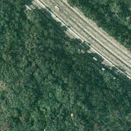
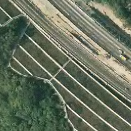
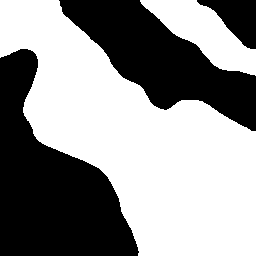
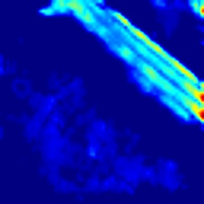
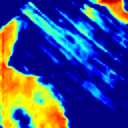
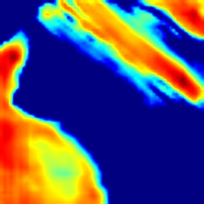

# DAHRNet for remote sensing image change detection

It is the implementation of the paper: A Deeply Attentive High-Resolution Network for Change Detection in Remote Sensing Images.

Here, we provide the pytorch implementation of the DAHRNet.


Our code is inspired by [STANet](https://github.com/justchenhao/STANet), we have added some new features for change detection. 


## Prerequisites

- windows or Linux 
- Python 3.6+
- CPU or NVIDIA GPU
- CUDA 9.0+
- PyTorch > 1.0
- visdom

## Installation
Recommend conducting your experiments in docker. [deepo](https://github.com/ufoym/deepo) is an open framework to assemble specialized docker images for deep learning research without pain.
Clone this repo:

```bash
git clone https://github.com/Githubwujinming/DAHRNet.git
cd DAHRNet
pip install -r requirements.txt
```

## Prepare Datasets

### download the change detection dataset

You could download the LEVIR-CD at https://justchenhao.github.io/LEVIR/;

The path list in the downloaded folder is as follows:

```
path to LEVIR-CD:
                ├─train
                │  ├─A
                │  ├─B
                │  ├─label
                ├─val
                │  ├─A
                │  ├─B
                │  ├─label
                ├─test
                │  ├─A
                │  ├─B
                │  ├─label
```

where A contains images of pre-phase, B contains images of post-phase, and label contains label maps.

### cut bitemporal image pairs

The original image in LEVIR-CD has a size of 1024 * 1024, which will consume too much memory when training. Therefore, we can cut the origin images into smaller patches (e.g., 256 * 256, or 512 * 512).  In our paper, we cut the original image into patches of 256 * 256 size without overlapping.

Make sure that the corresponding patch samples in the A, B, and label subfolders have the same name.

The processed and original datasets can be downloaded from the table below, we recommended downloading the processed one directly to get a quick start on our codes:


<table>
	<tr>
	    <th>Datasets</th>
	    <th>Processed Links</th>
	    <th>Original Links</th>	
	</tr>
    <tr>
	    <td>Season-varying Dataset [<a href="https://www.int-arch-photogramm-remote-sens-spatial-inf-sci.net/XLII-2/565/2018/">1</a>]</td>
	    <td rowspan="6">[<a href="https://pan.baidu.com/s/1F-anS4Z8qeOPASWo73LtXA?pwd=ml4h" target="_blank">Baidu Drive</a>]</td>
        <td>[<a href="https://drive.google.com/file/d/1GX656JqqOyBi_Ef0w65kDGVto-nHrNs9" target="_blank">Original</a>] </td>
	</tr>
	    <td>LEVIR-CD Dataset [<a href="https://www.mdpi.com/2072-4292/12/10/1662">2</a>]</td>
	    <td>[<a href="https://justchenhao.github.io/LEVIR/" target="_blank">Original</a>]</td>
    </tr>
	</tr>
	    <td>Google Dataset [<a href="https://ieeexplore.ieee.org/document/9161009/">3</a>]</td>
	    <td>[<a href="https://github.com/GeoZcx/A-deeply-supervised-image-fusion-network-for-change-detection-in-remote-sensing-images/tree/master/dataset" target="_blank">Original</a>]</td>
    </tr>
	</tr>
	    <td>Zhange Dataset [<a href="https://www.sciencedirect.com/science/article/abs/pii/S0924271620301532">4</a>]</td>
	    <td>[<a href="https://github.com/daifeng2016/Change-Detection-Dataset-for-High-Resolution-Satellite-Imagery" target="_blank">Original</a>]</td>
    </tr>
    </tr>
	    <td>WHU-CD Dataset [<a href="https://ieeexplore.ieee.org/document/8444434">5</a>]</td>
	    <td>[<a href="https://study.rsgis.whu.edu.cn/pages/download/building_dataset.html" target="_blank">Original</a>]</td>
    </tr>
    </tr>
	    <td>SYSU-CD Dataset [<a href="https://ieeexplore.ieee.org/document/9467555">6</a>]</td>
	    <td>[<a href="https://github.com/liumency/SYSU-CD" target="_blank">Original</a>]</td>        
    </tr>
</table> 


## Train
### Monitor training status

To view training results and loss plots, run this script and click the URL [http://localhost:8097](http://localhost:8097/).

```bash
python -m visdom.server
```

### train with our method
```sh
dataroot="../datasets/cd_dataset/SYSU-CD/train/"
val_dataroot="../datasets/cd_dataset/SYSU-CD/val/"
test_dataroot="../datasets/cd_dataset/SYSU-CD/test/"
lr=0.0001
model=DAHRN
batch_size=16
num_threads=4
save_epoch_freq=1
angle=20
gpu=1
port=8091
arch='base'
encoder='hrnet18'
Block='block'
preprocess='blur_rotate_transpose_hsvshift_noise_flip'
name=SYSU_DAHRNet
criterion='hybrid_bcl'
python ./train.py --epoch_count 1 -c 1 -r 'base' -d 4 -l $criterion --preprocess $preprocess  --arch $arch --encoder $encoder --Block $Block --display_port $port --gpu_ids $gpu --num_threads $num_threads --save_epoch_freq $save_epoch_freq --angle $angle --test_dataroot ${test_dataroot}  --dataroot ${dataroot} --val_dataroot ${val_dataroot} --name $name --lr $lr --model $model  --batch_size $batch_size 
```
```
cd DAHRNet
bash scripts/your_shell.sh
```
### Model weights
Model weights for Season-varying/LEVIR-CD/Google/SYSU datasets are available via [Baidu Drive](https://pan.baidu.com/s/1vLOtU03AgdsAai9B0jdIfg?pwd=40uy). 
<table>
	<tr>
	    <th>Datasets</th>
	    <th>F1 (%)</th>
	</tr>	
    <tr>
	    <td>Season-varying</td>
	    <td>96.94</td>
	</tr>
	    <td>LEVIR-CD</td>
	    <td>92.11</td>
    </tr>
	</tr>
	    <td>Google</td>
	    <td>89.97</td>
    </tr>
	</tr>
	    <td>SYSU</td>
	    <td>83.57</td>
    </tr>
</table> 

### train with other baselines
supported CD baselines: [FC-EF](http://arxiv.org/abs/1810.08462), [FC-Siam-conv](http://arxiv.org/abs/1810.08462), [FC-Siam-diff](http://arxiv.org/abs/1810.08462), [DSAMNet](https://ieeexplore.ieee.org/document/9467555), [SNUNet](https://ieeexplore.ieee.org/document/9355573), [FCCDN](https://arxiv.org/abs/2105.10860), [ChangeFormer](https://www.igarss2022.org/default.php), [DSIFNet](https://www.sciencedirect.com/science/article/abs/pii/S0924271620301532).
You can implement other models according to comments in [base_line](models/base_model.py).

```sh
dataroot="../datasets/cd_dataset/SYSU-CD/train/"
val_dataroot="../datasets/cd_dataset/SYSU-CD/val/"
test_dataroot="../datasets/cd_dataset/SYSU-CD/test/"
lr=0.0001
model=FCS
batch_size=16
num_threads=4
save_epoch_freq=1
angle=20
gpu=1
port=8089
name=SYSU_SNUN
arch='FCSC' # if nessceary
preprocess='blur_rotate_transpose_hsvshift_noise_flip'
# train 
python ./train.py --continue_train --epoch_count 89  --display_port $port --gpu_ids $gpu  --arch $arch --num_threads $num_threads --save_epoch_freq $save_epoch_freq --angle $angle --dataroot ${dataroot} --test_dataroot ${test_dataroot} --val_dataroot ${val_dataroot} --name $name --lr $lr --model $model  --batch_size $batch_size --load_size 256 --crop_size 256 --preprocess $preprocess
```
## Val
You could edit the file val.py, CD algorithm will save five images for each pair
for example:
```python
if __name__ == '__main__':
    opt = TestOptions().parse()   # get training options
    opt = make_val_opt(opt)
    opt.phase = 'val'
    opt.dataroot = 'path-to-LEVIR-CD-test' # data root 
    opt.dataset_mode = 'changedetection'
    opt.n_class = 2
    opt.arch = 'FCEF'
    opt.model = 'FCS' # model type
    opt.name = 'LEVIR_FCS' # project name
    opt.results_dir = 'LEVIR_FCS/' # save predicted images 
    opt.epoch = 'best-epoch-in-val' # which epoch to test
    opt.num_test = np.inf
    val(opt)
```
white for true positive, black for true negative, red for false positive, and blue for false negative
<table rules="none" align="center" border="0">
	<tr>
		<td>
			<center>
				
				<br/>
				<font color="AAAAAA">T1</font>
			</center>
		</td>
		<td>
			<center>
				
				<br/>
				<font color="AAAAAA">T2</font>
			</center>
		</td>
        <td>
			<center>
				
				<br/>
				<font color="AAAAAA">label</font>
			</center>
		</td>
        <td>
			<center>
				
				<br/>
				<font color="AAAAAA">pred</font>
			</center>
		</td>
        <td>
			<center>
				
				<br/>
				<font color="AAAAAA">comparision</font>
			</center>
		</td>
	</tr>
</table>

## Visualization of feature maps
This grad_cam is modified from [pytorch-grad-cam](https://github.com/jacobgil/pytorch-grad-cam) for change detection, see examples in scrpt util/grad_vis.py
```python
'''
supported grad_cam: GradCAM,HiResCAM,GradCAMElementWise,GradCAMPlusPlus,XGradCAM,EigenCAM,EigenGradCAM,LayerCAM.
'''
model = Net()
saved_path = 'saved_model.pth'
model = load_by_path(model, saved_path)# load your model
model = CDModelOutputWrapper(model)# you can customize for your model
# target_layer = [model.model.cube.cubes[0].stageY.branches[0]]
target_layer = [model.model.cbuilder.decoder1]# give target layer you want to visualizate
# you should point the 'target_layer' belongs to 'seg' branch or 'cd' branch.
cam = CDGradCamUtil(model,target_layer,gradcam='GradCAM', use_cuda=True, branch='seg')
img1 = Image.open('.png')
img2 = Image.open('.png')
grad_gray = cam(img1, img2)
cam.cd_save_cam()# save heatmap in the dir of './grad_imgs'
```
<table rules="none" align="center" border="0">
	<tr>
		<td>
			<center>
				
				<br/>
				<font color="AAAAAA">T1</font>
			</center>
		</td>
		<td>
			<center>
				
				<br/>
				<font color="AAAAAA">T2</font>
			</center>
		</td>
        <td>
			<center>
				
				<br/>
				<font color="AAAAAA">label</font>
			</center>
		</td>
	</tr>
    <tr>
		<td>
			<center>
				
				<br/>
				<font color="AAAAAA">seg_GradCAM_heatmap1</font>
			</center>
		</td>
		<td>
			<center>
				
				<br/>
				<font color="AAAAAA">seg_GradCAM_heatmap2</font>
			</center>
		</td>
        <td>
			<center>
				
				<br/>
				<font color="AAAAAA">cd_GradCAM_heatmap</font>
			</center>
		</td>
	</tr>
</table>

